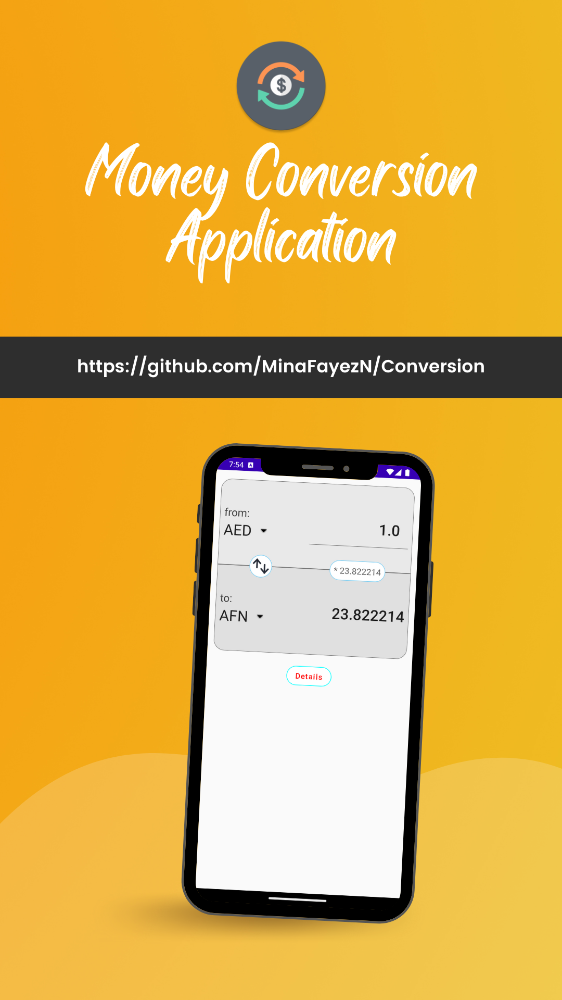

 

The goal of this project is to demonstrate how we can use most of recent tools and technologies to create a simple app to convert money between currencies, following the best development practices. It's our interpretation and adaptation of the official [architecture](https://developer.android.com/topic/architecture) guidelines provided by Google.

## Clean architecture with 2 main layers
- Data (for API and caching)
- AndroidApp (for UI logic, with MVVM)

 
I didn't use Domain layer as it's not needed here

## Tests
- [Mockk](https://mockk.io/) library
- Unit tests

## Other useful features
- Dependency injection (with [Hilt](http://google.github.io/hilt/))
- Network calls (with [Retrofit](https://square.github.io/retrofit/))
    - Using Offline/Online Caching to reduce the calls.
- Reactive programming (with [Kotlin Flows](https://kotlinlang.org/docs/reference/coroutines/flow.html))
- Android architecture components to share ViewModels during configuration changes
- Declarative UI (with [Jetpack Compose](https://developer.android.com/jetpack/compose))
- Flexi Api (Documentation [Link](https://apilayer.com/marketplace/fixer-api)

# Notes
- This repo is adding the ApPI key on `local.properties` file as apiKey attribute (you can change the value in case of this one reached monthly limit
